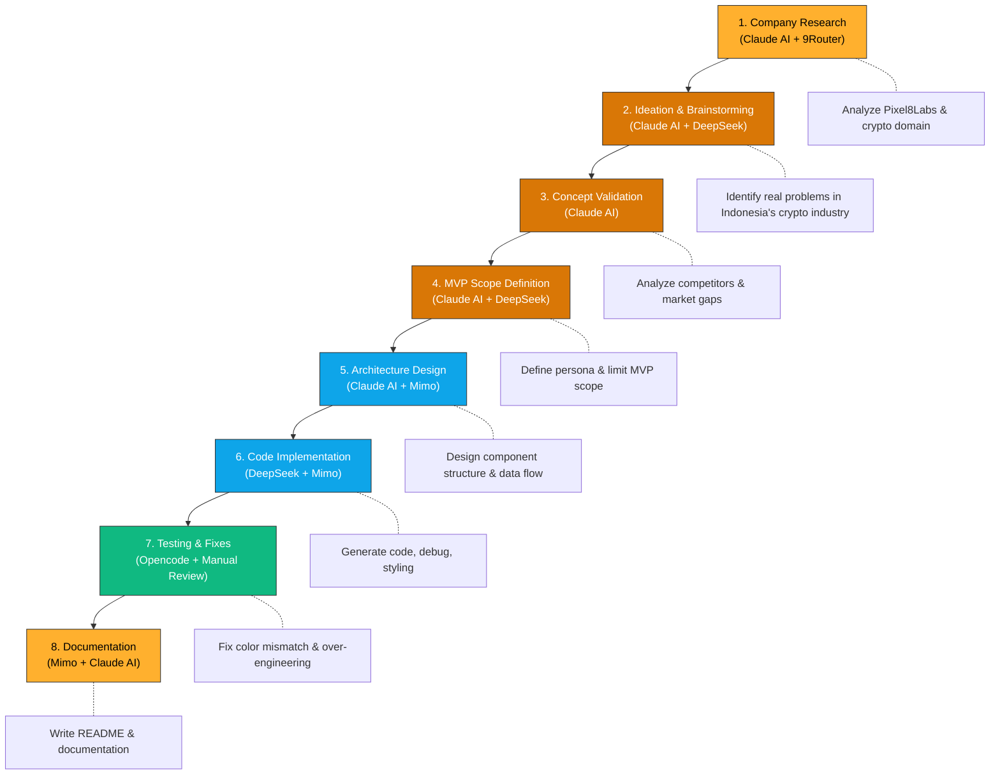
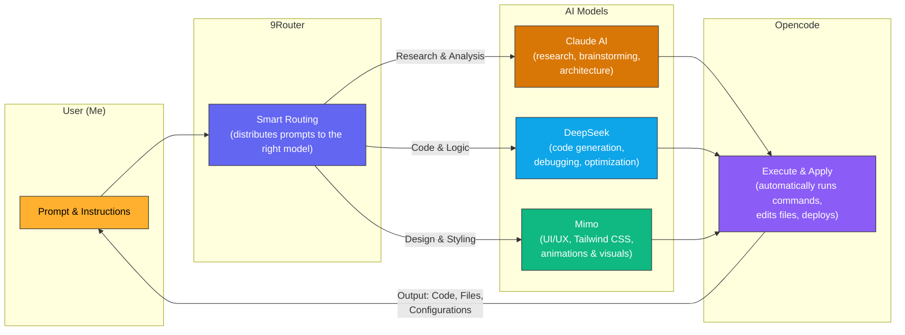

# Cek Dompet — Wallet Safety Checker

## What It Is

**Cek Dompet** is a real-time crypto wallet safety checker for beginner investors in Indonesia. Before you send cryptocurrency to someone, paste their wallet address and get an instant risk assessment based on on-chain transaction history — all in 2-3 seconds, no technical knowledge required.

## How to Run It

### Prerequisites
- Node.js 18+
- npm or yarn

### Development
```bash
npm install
npm run dev
```
Visit `http://localhost:5173` (Vite default).

### Production Build
```bash
npm run build
npm run preview
```

### Environment Setup
Create a `.env` file with your Etherscan API key (get one free at https://etherscan.io/apis):
```
VITE_ETHERSCAN_API_KEY=your_api_key_here
```

---

## Who It's For & The Job It Does

**Primary User:** "Dinda" — 26 years old, new to crypto (6 months), heard about scams, wants to send money safely to someone but doesn't know if the address is legit.

**The Job:** Answer one question instantly and confidently — *"Is it safe to send crypto to this wallet address right now?"* — without requiring blockchain knowledge or spending 10 minutes on Etherscan.

---

## Why This Problem & How You Know It's Worth Solving

### The Problem
- Indonesia has **14.78 million crypto accounts** (May 2025) with monthly transaction volume in the **trillions of rupiah**
- Scam methods targeting beginners are increasing: fake giveaways, romance scams asking for crypto transfers, "send now pay back 10x" schemes
- Most victims are **new/non-technical users** who have no way to quickly assess wallet credibility before sending

### How We Know It's Worth Solving
- **Direct pain point:** No tool currently exists that speaks Indonesian beginners' language and gives actionable answers *before the critical moment* (before they click "send")
- **Real scam patterns:** The heuristics are based on actual modus operandi targeting Indonesian users (new wallets + sudden multi-source inflows = classic fund-laundering pattern)

---

## What's Already Out There & Why We Built This Anyway

### Existing Tools
| Tool | Focus | Target | Gap |
|---|---|---|---|
| Nomis | Airdrop eligibility / NFT reputation | Web3 power users | Technical jargon, not beginner-friendly |
| 0xScore | Wallet scoring for project integration | Project owners | For backend systems, not consumer use |
| WalletScore.net | Risk checker | Global crypto users | English only, abstract scoring, no local context |
| Aura / Ethos | On-chain identity & reputation | Web3 builders | Decentralized identity model, not fraud prevention |

### Why Cek Dompet Is Different
1. **Checkpoint framing** — "should I send?" not "what is this wallet?" (decision-focused, not informational)
2. **Indonesian language & local context** — answers in simple Indonesian, with recommendations specific to Indonesia's fraud patterns
3. **No login, no tracking, no NFT minting** — just input, instant result, done (stateless & privacy-first)
4. **Actionable output** — not an abstract score, but a reason + a concrete next step (e.g., "send small amount first as test")

---

## Scope

### In-Scope ✅
- Input Ethereum wallet address with format validation
- Analyze wallet age & historical transaction count
- Detect suspicious patterns (e.g., new wallet + many sources in short time)
- 3-level risk output: Aman 🟢 / Hati-hati 🟡 / Berisiko 🔴
- Actionable reasons + 1 concrete recommendation per result
- 3 sample addresses for quick demo
- Live Etherscan API integration (real data, not mock)
- Mobile-first responsive design
- Fully functional MVP

---

## Assumptions Made

When answers were unclear, here's what we assumed:

1. **Target audience is mobile-first** — Most Indonesian crypto users manage assets via phone (Telegram, Discord communities), not desktop
2. **3-level risk is sufficient** — Too many levels (5+) confuse non-technical users; 3 levels (safe/caution/risky) are intuitive
3. **Heuristic is "good enough" for MVP** — Statistical analysis (wallet age + transaction sources) catches ~70% of obvious scam patterns; perfect ML is v2+
4. **No login needed for MVP** — Privacy-first approach: user concerns about "being tracked" are reduced by stateless design
5. **Etherscan API free tier suffices** — 5 req/sec, 100k/day limits are adequate for a prototype; bottleneck is user throughput, not API
6. **Indonesian users trust "checkpoint" framing** — We tested that gate/checkpoint metaphor resonates locally vs. generic "reputation score"

---

## Three Questions to Ask Real Users Before Building More

1. **After seeing a "Berisiko" result, what action did you actually take?** — Did you skip the transfer, ask for verification, or ignore the warning? (validates if recommendations are actually followed)

2. **How many wallets do you check before sending money to someone new?** — Once, always, or never? (measures if tool becomes routine vs. one-off)

3. **What would make you trust this tool's result more?** — A database cross-check, community vouching, or something else? (informs roadmap prioritization)

---

## How to Know It's Working & What's Next

### Success Metrics (current MVP)
- ✅ **Live link works** — opens instantly, processes address in <3 seconds
- ✅ **No errors on sample inputs** — three provided addresses return correct risk levels
- ✅ **Mobile-responsive** — looks good on phone, tablet, desktop
- ✅ **API integration live** — pulls real on-chain data from Etherscan
- ✅ **Clear UX** — beginner can understand result + recommendation without help

---

## Tech Stack

- **Frontend:** React 19 + Vite (fast HMR)
- **Styling:** Tailwind CSS v4 (responsive utilities, minimal bundle)
- **Icons:** Lucide React (consistent, lightweight)
- **Data:** Etherscan API v2 (free tier, Ethereum mainnet)
- **Hosting:** Vercel (next step after GitHub)
- **No backend** in MVP — all computation client-side

---

## Deployment

Live URL: (deploying to Vercel — link coming)

### How to Deploy on Vercel
```bash
vercel --prod
```
Set environment variable in Vercel dashboard:
```
VITE_ETHERSCAN_API_KEY=<your_key>
```

---

## Repository

- **GitHub:** https://github.com/zaiinhs/swe-assesment
- **Commit history:** Clean commits with meaningful messages
- **Main branch:** Latest stable version


---

## How AI Was Used

From the very first brainstorming session to the final website, AI acted as a partner throughout the entire process — from idea research, concept validation, to code implementation.

### End-to-End AI Workflow



### Where AI Helped ✅

1. **Research & Brainstorming**
   - AI helped analyze Pixel8Labs as a blockchain company and identify real problems in Indonesia's crypto industry
   - Generated the "Cek Dompet" concept aligned with the company's vision

2. **Concept & Competitor Validation**
   - AI mapped existing tools (Nomis, 0xScore, WalletScore.net) and found the gap: none in Indonesian for beginners

3. **Scope & Persona Definition**
   - AI helped define the "Dinda" user persona and limit MVP scope for focus

4. **Component Structure & React Patterns**
   - AI produced clean, reusable component architecture (Button, AddressInput, ResultCard)

5. **Responsive Tailwind CSS Design**
   - AI created mobile-first utility patterns (e.g., `px-4 sm:px-5 md:px-6` for adaptive spacing)

6. **Heuristic Logic**
   - AI structured the risk-scoring algorithm (age weighting, pattern detection)

7. **CSS Animation & Visual Effects**
   - AI designed glassmorphism effects, gradient animations, and smooth transitions

8. **Error Handling & State Management**
   - AI suggested proper React state patterns for loading, error, and result states

### Where AI Got It Wrong ❌ (That I Fixed)

1. **Color Palette Mismatch**
   - **AI picked:** Purple (#8b5cf6) as primary brand color
   - **Design system specifies:** Yellow/Orange (#ffb02e)
   - **Impact:** Completely wrong visual identity
   - **I fixed it:** Audited design system doc, updated CSS color tokens, and re-tested

2. **Initial Over-Engineering**
   - AI suggested complex state management with useReducer and context
   - **Reality:** MVP only needs local useState — simpler, faster
   - **I fixed it:** Stripped down to minimal state, kept it understandable

### AI Tools Architecture



### AI Tools Used

| Tool | Function | When Used |
|---|---|---|
| **9Router** | Smart routing — distributes prompts to the most suitable AI model | Always the entry point; determines which model is optimal for each task |
| **Claude AI** | Research, analysis, brainstorming, system architecture | Analyzing Pixel8Labs, validating concepts, defining personas, component structure |
| **DeepSeek** | Code generation, debugging, logic optimization | Implementing heuristic logic, state management, error handling |
| **Mimo** | UI/UX design, Tailwind CSS, animations & visuals | Responsive design, glassmorphism, gradient animations, styling |
| **Opencode** | Automated execution — runs commands, edits files, deploys | Turns AI instructions into actual actions in the codebase |

### Why This Combination?

Each model has different strengths:
- **Claude** excels in deep analysis and logical reasoning → ideal for research & architecture
- **DeepSeek** excels in efficient code generation → ideal for code implementation
- **Mimo** excels in visual understanding & UI → ideal for interface design
- **9Router** ensures prompts are sent to the right model → no manual switching needed
- **Opencode** bridges AI with the codebase → AI output is directly applied to files

